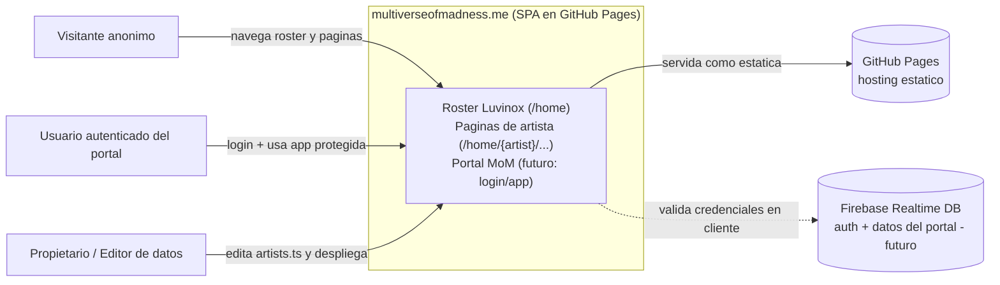
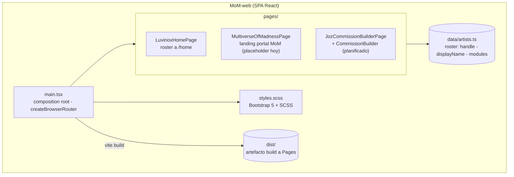
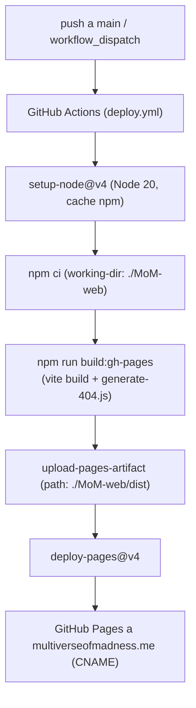
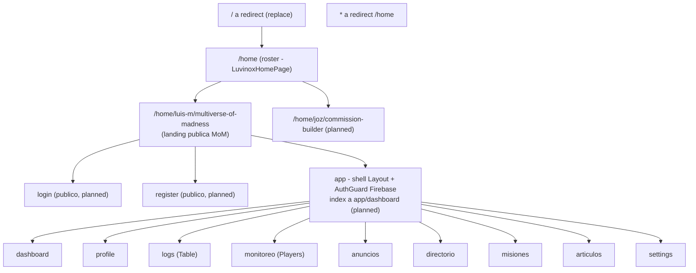

# Documento de Arquitectura (arc42) — multiverseofmadness.me

> Sitio personal de Luis Miguel Medina, desplegado en GitHub Pages bajo el dominio
> personalizado `multiverseofmadness.me`. SPA construida con React 19 + Vite 8.
>
> **Estado:** vivo / en evolución. La decisión central documentada aquí es la
> **convención de rutas** `home/{artist}/{page}` (ver sección 9, ADR-0001).
>
> **Idioma:** español. **Plantilla:** arc42 (12 secciones).

---

## 1. Introducción y Objetivos

`multiverseofmadness.me` es el sitio personal del propietario. Funciona como un
*roster* tipo "Luvinox": una tira de artistas seleccionables; al elegir un artista
se muestra su página dedicada (sus *modules*: brief, redes, web, o un *portal*).

Hoy existen dos artistas en `MoM-web/src/data/artists.ts`:

- **`luis-m` (Luis.M):** su página *es* el portal "Multiverse Of Madness". Tiene un
  módulo `portal` que apunta a la ruta canónica `/home/luis-m/multiverse-of-madness`.
  A futuro, este portal re-incorpora el viejo panel de administración Angular
  (login/registro + app con guard de Firebase).
- **`joz` (Joz):** ilustradora freelance; su página será un *commission builder*
  (cambio OpenSpec `joz-commission-builder`). Aún sin ruta dedicada.

### 1.1 Objetivos de calidad (Top 3)

| # | Objetivo | Por qué importa |
|---|----------|-----------------|
| 1 | **Rutas predecibles y consistentes** | El propietario fija una convención única `home/{artist}/{page}` para todo el sitio; las URLs deben ser deducibles a partir del artista y la página. |
| 2 | **Compatibilidad de enlaces (deep links)** | Es un SPA en GitHub Pages; los enlaces profundos y los marcadores antiguos deben seguir resolviendo (fallback `404.html` + redirecciones de retrocompatibilidad). |
| 3 | **Bajo coste de mantenimiento** | Proyecto personal de una persona. La arquitectura debe ser lean: cero backend propio, despliegue automático, mínima ceremonia. |

### 1.2 Stakeholders

| Rol | Interés |
|-----|---------|
| Propietario (Luis.M) | Dueño del producto, desarrollador y autor de las decisiones. |
| Joz (artista) | Su página/commission builder vive dentro del roster. |
| Visitantes | Navegan el roster y las páginas de artistas. |

---

## 2. Restricciones (Constraints)

| Tipo | Restricción |
|------|-------------|
| Hosting | **GitHub Pages** (estático). No hay servidor propio ni capacidad de redirecciones HTTP del lado servidor: todo redireccionamiento y *routing* es del lado cliente. |
| Dominio | Dominio personalizado `multiverseofmadness.me` vía fichero `CNAME` en la raíz del repo. |
| SPA / deep links | `createBrowserRouter` usa rutas reales (HTML5 history). En Pages se requiere un `404.html` que sirva de fallback para que los deep links no devuelvan un 404 real. |
| Stack fijo | React 19, Vite 8, `react-router-dom` v7, TypeScript, Bootstrap 5, SCSS. |
| Build/deploy | GitHub Actions (`.github/workflows/deploy.yml`): `npm ci` + `npm run build:gh-pages` en `./MoM-web`, sube `./MoM-web/dist` a Pages. Node 20. |
| Auth | El futuro portal usa Firebase Realtime DB con niveles de permiso 1..4. Al ser un host estático, **es soft-gating de UX, no una frontera de seguridad real** (ver sección 8 y riesgos). |
| Equipo | Una sola persona. Sin proceso pesado. |

---

## 3. Contexto y Alcance (Context & Scope)

### 3.1 Contexto de negocio



- **Entrada:** navegador del visitante.
- **Dependencia externa (futura):** Firebase Realtime DB para el portal de Luis.M.
- **Fuera de alcance:** cualquier backend propio, pagos, e-commerce real.

### 3.2 Contexto técnico

| Interfaz | Detalle |
|----------|---------|
| HTTP (estático) | GitHub Pages sirve los artefactos de `dist`. |
| Routing cliente | `react-router-dom` v7 (`createBrowserRouter`) en `MoM-web/src/main.tsx`. |
| Firebase (futuro) | SDK cliente desde el bundle, autenticación y lectura/escritura del portal. |

---

## 4. Estrategia de Solución (Solution Strategy)

- **SPA estática, sin backend propio.** Toda la lógica vive en el cliente; el estado del portal se delega a Firebase.
- **Routing declarativo centralizado** en `main.tsx` con `createBrowserRouter`. Una única convención de URL (`home/{artist}/{page}`) gobierna todas las rutas — ver ADR-0001.
- **El roster es el índice.** `/home` lista los artistas; cada artista expone sus páginas bajo `/home/{artist}/{page}`. Las páginas internas del portal extienden esa base.
- **Migración 1:1 del panel Angular** a React Router preservando los segmentos de ruta originales (incluido el segmento `app` y los slugs en español) para poder mapear redirecciones antiguas → nuevas de forma trivial.
- **Despliegue automático** vía GitHub Actions en cada push a `main`; `404.html` (generado por `generate-404.js`) como fallback de deep links.

---

## 5. Vista de Bloques de Construcción (Building Block View)

### 5.1 Nivel 1 — Caja blanca del SPA



| Bloque | Responsabilidad |
|--------|-----------------|
| `main.tsx` | Define el árbol de rutas y monta `RouterProvider`. Punto único donde se materializa la convención de rutas. |
| `data/artists.ts` | Define los artistas. El campo `handle` es el **slug canónico del artista** (segmento `{artist}`). El módulo `portal` contiene la `route` que debe alinearse con la convención. |
| `pages/LuvinoxHomePage` | Renderiza el roster. Mapea a `/home`. |
| `pages/MultiverseOfMadnessPage` | Landing del portal de Luis.M. Mapea a `/home/luis-m/multiverse-of-madness`. |

### 5.2 Nivel 2 — Subárbol del portal MoM (planificado)

El portal de Luis.M (re-migrado desde Angular) se modela como un subárbol bajo
`/home/luis-m/multiverse-of-madness`:

- **Base (pública):** landing/marketing.
- **Entrada pública:** `login`, `register` (hijos directos de la base).
- **Aplicación protegida:** segmento `app` (shell `Layout` + guard de Firebase, `Outlet`), con páginas hijas: `dashboard`, `profile`, `logs`, `monitoreo`, `anuncios`, `directorio`, `misiones`, `articulos`, `settings`.

La topología exacta de rutas es la tabla autoritativa del ADR-0001 (sección 9).

---

## 6. Vista en Tiempo de Ejecución (Runtime View)

### 6.1 Escenario: visitante abre un enlace profundo a una página de artista

1. El navegador pide `https://multiverseofmadness.me/home/luis-m/multiverse-of-madness`.
2. GitHub Pages no encuentra ese path estático → sirve `404.html` (fallback SPA).
3. El bundle arranca, `createBrowserRouter` resuelve el path actual y renderiza `MultiverseOfMadnessPage`.

### 6.2 Escenario: redirección de retrocompatibilidad

1. Marcador antiguo `/multiverse-of-madness`.
2. El router lo intercepta (`<Navigate replace>`) y emite un *redirect* a `/home/luis-m/multiverse-of-madness`.
3. La URL canónica queda en la barra de direcciones.

### 6.3 Escenario: acceso al subárbol protegido (futuro)

1. Visitante navega a `.../app/dashboard`.
2. El loader/guard del segmento `app` comprueba el estado de Firebase.
3. Si no autenticado → redirige a `.../login`. Si autenticado → `Outlet` renderiza la página hija.

---

## 7. Vista de Despliegue (Deployment View)



| Elemento | Valor |
|----------|-------|
| Trigger | `push` a `main` + `workflow_dispatch`. |
| Build | `npm run build:gh-pages` en `./MoM-web` (`vite build` + `generate-404.js`). |
| Artefacto | `./MoM-web/dist`. |
| Dominio | `multiverseofmadness.me` (fichero `CNAME`, `.nojekyll` presente). |
| Concurrencia | grupo `pages`, sin cancelar en progreso. |

---

## 8. Conceptos Transversales (Crosscutting Concepts)

### 8.1 Routing (concepto central)

El routing es el concepto transversal dominante de este proyecto. Reglas:

- **Convención única:** toda ruta de página cumple literalmente `/home/{artist}/{page}` (ver ADR-0001 para la regla, el algoritmo de slug y la tabla completa).
- **`{artist}` = `handle` verbatim** de `artists.ts` (los handles SON los slugs canónicos de artista; no se recalculan).
- **`{page}` = slug kebab-case** del `displayName` de la página, según el algoritmo de slug del ADR-0001.
- **Subpáginas** (portal/app) extienden la base con segmentos kebab-case adicionales.
- **Exenciones:** solo `/home` (el roster) y el redirect `/` → `/home` están exentos del segmento `{artist}`.
- **Fuente de verdad de rutas:** `MoM-web/src/main.tsx`. La `route` del módulo `portal` en `artists.ts` ya está alineada (`/home/luis-m/multiverse-of-madness`) y debe mantenerse sincronizada al añadir páginas.

### 8.2 Deep links en host estático

`404.html` (generado en build por `generate-404.js`) sirve de fallback para que `createBrowserRouter` (history API) resuelva cualquier path en cliente. `.nojekyll` evita el procesamiento Jekyll.

### 8.3 Autenticación (futuro portal)

Firebase Realtime DB con niveles de permiso 1..4. **Al ser un host estático y un bundle público, esto es soft-gating de UX, no una frontera de seguridad.** Todo el código de rutas y la lógica del cliente son descargables. No deben colocarse secretos ni datos sensibles tras este "guard".

### 8.4 Estilos

Bootstrap 5 + SCSS global (`styles.scss`). Sin sistema de diseño formal por ahora.

---

## 9. Decisiones de Arquitectura (Architecture Decisions)

### ADR-0001: Convención de estructura de rutas (`home/{artist}/{page}`)

**Estado:** Aceptada (implementada en parte) · **Fecha:** 2026-06-23 · **Decisor:** Propietario (Luis.M)

#### Contexto

El sitio crecerá: la página de Joz (commission builder) necesitará ruta propia, y
el viejo panel Angular (login/registro + app con guard Firebase, niveles 1..4) será
re-migrado a React. Sin una convención, cada página inventaría su propio path,
produciendo URLs inconsistentes y enlaces frágiles.

Históricamente, `main.tsx` definía tres rutas planas y ad-hoc (`/` → roster,
`/multiverse-of-madness` → portal, `*` → roster). El propietario fija una regla de
calidad de rutas: **toda ruta de página debe seguir el patrón
`home/{artist-name}/{page-name}`**. Ejemplo dado: artista "Luis. M" + página
"MultiverseOfMadness" → `/home/luis-m/multiverse-of-madness`.

El núcleo de la convención ya está implementado en `main.tsx`:

```ts
// Route convention: /home/{artist}/{page} — see docs/arc42 (ADR-0001).
const router = createBrowserRouter([
  { path: '/', element: <Navigate to="/home" replace /> },
  { path: '/home', element: <LuvinoxHomePage /> },
  { path: '/home/luis-m/multiverse-of-madness', element: <MultiverseOfMadnessPage /> },
  // Back-compat: old flat route -> canonical home/{artist}/{page}
  { path: '/multiverse-of-madness', element: <Navigate to="/home/luis-m/multiverse-of-madness" replace /> },
  { path: '*', element: <Navigate to="/home" replace /> },
]);
```

El resto de la tabla (página de Joz y subárbol del portal Angular) está pendiente
de implementar conforme avance la migración.

#### Decisión

Adoptar la convención `/home/{artist}/{page}` para **todas** las rutas de página,
con las reglas, el algoritmo de slug, la tabla de rutas, el anidamiento del portal y
las redirecciones de retrocompatibilidad que siguen.

##### Regla de nomenclatura

> Toda ruta de página DEBE coincidir literalmente con el patrón `/home/{artist}/{page}`,
> donde `{artist}` es el campo `handle` del artista en `artists.ts` (kebab-case) y
> `{page}` es el slug kebab-case del nombre visible de la página. Las subpáginas del
> portal/app extienden esa base añadiendo más segmentos kebab-case
> (`/home/{artist}/{page}/{sub-page}`). Solo `/home` (el roster) y el redirect
> `/` → `/home` están exentos de requerir un `{artist}`.

##### Algoritmo de slug

1. Pasar el nombre visible a minúsculas.
2. Normalizar/eliminar diacríticos vía Unicode **NFD** y quitar marcas combinantes (p. ej. `"José"` → `"jose"`).
3. Reemplazar `"&"` por `"and"`.
4. Reemplazar cada secuencia de caracteres no alfanuméricos (espacios, puntos, guiones bajos, barras) por un único guion.
5. Colapsar guiones repetidos y recortar guiones al inicio/final.

**Ejemplos:** `"Luis. M"` → `luis-m`; `"MultiverseOfMadness"` / `"Multiverse Of Madness"` → `multiverse-of-madness` (ojo: el camelCase **no** se separa automáticamente, así que el nombre origen debe contener ya los cortes de palabra o el slug se trata como un único token); `"Joz"` → `joz`; `"Monitoreo"` → `monitoreo`.

> El segmento de artista se toma **verbatim** del campo `handle` existente en lugar de
> recalcularse; por tanto los `handle` SON los slugs canónicos de artista.

##### Tabla de rutas (autoritativa)

| Path | Artist | Page | Estado | Renderiza / Mapea a | Notas |
|------|--------|------|--------|---------------------|-------|
| `/` | (ninguno) | (redirect) | **implementado** | Redirect (replace) a `/home` | Raíz = redirect canónico, no página. |
| `/home` | (ninguno) | Home | **implementado** | `LuvinoxHomePage` (tira del roster) | El roster. Exento del segmento `{artist}` por ser el índice sobre todos los artistas. |
| `/home/luis-m/multiverse-of-madness` | luis-m | Multiverse Of Madness | **implementado** | `MultiverseOfMadnessPage` (landing del portal; hoy placeholder estático) | Ejemplo canónico del propietario. La `route` del módulo `portal` en `artists.ts` ya apunta a este path. |
| `/home/joz/commission-builder` | joz | Commission Builder | planned | `JozCommissionBuilderPage` envolviendo `<CommissionBuilder/>` | Joz hoy NO tiene ruta dedicada (el builder es inline en el roster según `joz-commission-builder`). Slug de la página pendiente de confirmación — ver preguntas abiertas. |
| `/home/luis-m/multiverse-of-madness/login` | luis-m | Multiverse Of Madness | planned | `LoginComponent` Angular migrado | PÚBLICA (login-gated, no auth-guarded). Antiguo `/login` Angular. Hermana de `register`. |
| `/home/luis-m/multiverse-of-madness/register` | luis-m | Multiverse Of Madness | planned | `RegisterComponent` Angular migrado | PÚBLICA. Antiguo `/register` Angular. |
| `/home/luis-m/multiverse-of-madness/app` | luis-m | Multiverse Of Madness | planned | Shell `Layout` del portal (auth-guarded vía Firebase, niveles 1..4); el index redirige a `app/dashboard` | Mapea al `/app` Angular. AUTH-GUARDED. Todos los hijos cuelgan de este segmento `app` → frontera única del subárbol protegido. |
| `/home/luis-m/multiverse-of-madness/app/dashboard` | luis-m | Multiverse Of Madness | planned | `DashboardComponent` (migrado) | AUTH-GUARDED. Hijo por defecto del shell `app`. |
| `/home/luis-m/multiverse-of-madness/app/profile` | luis-m | Multiverse Of Madness | planned | `ProfileComponent` (migrado) | AUTH-GUARDED. |
| `/home/luis-m/multiverse-of-madness/app/logs` | luis-m | Multiverse Of Madness | planned | Vista Table (migrada; ruta Angular `logs`) | AUTH-GUARDED. `logs` = componente Table. Slug inglés `logs` conservado del segmento Angular; ver preguntas abiertas sobre consistencia ES/EN. |
| `/home/luis-m/multiverse-of-madness/app/monitoreo` | luis-m | Multiverse Of Madness | planned | Vista Players (migrada; ruta Angular `monitoreo`) | AUTH-GUARDED. `monitoreo` = componente Players. Slug conservado verbatim del Angular; ver preguntas abiertas sobre anglicizar a `players`. |
| `/home/luis-m/multiverse-of-madness/app/anuncios` | luis-m | Multiverse Of Madness | planned | Vista Anuncios (migrada) | AUTH-GUARDED. Slug español conservado del Angular. |
| `/home/luis-m/multiverse-of-madness/app/directorio` | luis-m | Multiverse Of Madness | planned | Vista Directorio (migrada) | AUTH-GUARDED. Slug español conservado del Angular. |
| `/home/luis-m/multiverse-of-madness/app/misiones` | luis-m | Multiverse Of Madness | planned | Vista Misiones (migrada) | AUTH-GUARDED. Slug español conservado del Angular. |
| `/home/luis-m/multiverse-of-madness/app/articulos` | luis-m | Multiverse Of Madness | planned | Vista Articulos (migrada) | AUTH-GUARDED. Slug español conservado del Angular (`articulos`, acento eliminado). |
| `/home/luis-m/multiverse-of-madness/app/settings` | luis-m | Multiverse Of Madness | planned | `SettingsComponent` (migrado) | AUTH-GUARDED. |
| `/multiverse-of-madness` | luis-m | Multiverse Of Madness | **implementado** | Redirect (replace) a `/home/luis-m/multiverse-of-madness` | LEGACY plano. Ya redirige en `main.tsx`. Ver retrocompatibilidad. |
| `*` | (ninguno) | (fallback) | **implementado** | Redirect (replace) a `/home` | El wildcard redirige cualquier path desconocido a `/home`. |

##### Anidamiento del portal

El portal MoM **es** la página de Luis.M, así que su base es
`/home/luis-m/multiverse-of-madness` (profundidad 3). Las páginas internas anidan
extendiendo esa base, en dos niveles:

1. **Entrada PÚBLICA** — hijos directos de la base:
   `.../login` y `.../register` (profundidad 4).
2. **Aplicación AUTH-GUARDED** — bajo un segmento `app` explícito:
   `.../app` (profundidad 4, shell `Layout` + guard Firebase), con cada página del
   área de dashboard como hijo en profundidad 5 (p. ej. `.../app/dashboard`,
   `.../app/monitoreo`, `.../app/settings`).

El segmento `app` se conserva deliberadamente de la estructura Angular para que el
subárbol protegido mapee a una única ruta de React Router con loader/guard y un
`Outlet`; `login`/`register` quedan **fuera** de `app` para seguir siendo accesibles
sin autenticación. El index de la base del portal (sin sub-segmento) renderiza la
landing/marketing pública del MoM; el index de `app` redirige a `app/dashboard`.

##### Redirecciones de retrocompatibilidad

| Desde | Hacia | Estado |
|-------|-------|--------|
| `/` | `/home` | implementado |
| `/multiverse-of-madness` | `/home/luis-m/multiverse-of-madness` | implementado |
| `/login` | `/home/luis-m/multiverse-of-madness/login` | planned |
| `/register` | `/home/luis-m/multiverse-of-madness/register` | planned |
| `/app` | `/home/luis-m/multiverse-of-madness/app/dashboard` | planned |
| `/app/dashboard` | `/home/luis-m/multiverse-of-madness/app/dashboard` | planned |
| `/app/profile` | `/home/luis-m/multiverse-of-madness/app/profile` | planned |
| `/app/logs` | `/home/luis-m/multiverse-of-madness/app/logs` | planned |
| `/app/monitoreo` | `/home/luis-m/multiverse-of-madness/app/monitoreo` | planned |
| `/app/anuncios` | `/home/luis-m/multiverse-of-madness/app/anuncios` | planned |
| `/app/directorio` | `/home/luis-m/multiverse-of-madness/app/directorio` | planned |
| `/app/misiones` | `/home/luis-m/multiverse-of-madness/app/misiones` | planned |
| `/app/articulos` | `/home/luis-m/multiverse-of-madness/app/articulos` | planned |
| `/app/settings` | `/home/luis-m/multiverse-of-madness/app/settings` | planned |
| `*` (path desconocido) | `/home` | implementado |

##### Árbol de rutas (visión global)



#### Consecuencias

**Positivas:**
- URLs predecibles y deducibles a partir de `handle` + nombre de página.
- El roster es un índice claro (`/home`) y cada artista tiene un espacio de nombres propio (`/home/{artist}/...`).
- La migración Angular es trazable 1:1 (segmento `app` y slugs preservados → mapa de redirecciones trivial).
- Una sola URL canónica para home (`/home`), con `/` y `*` redirigiendo a ella.

**Negativas / costes:**
- URLs largas en el portal (el slug `multiverse-of-madness` se repite en todas las subrutas).
- El redirect `/` → `/home` añade un salto extra frente a renderizar el roster directamente en `/`.
- Mantener `artists.ts` (`handle`, `portal.route`) sincronizado con `main.tsx` es responsabilidad manual.
- Persisten slugs mixtos ES/EN en el portal (`monitoreo`/`anuncios` vs `login`/`dashboard`).

#### Alternativas consideradas

1. **Rutas planas ad-hoc (statu quo previo):** `/multiverse-of-madness`, `/login`, etc. Rechazada: no escala, sin namespacing por artista, URLs inconsistentes.
2. **`/{artist}/{page}` sin prefijo `home`:** más corto, pero colisiona el namespace del artista con rutas top-level y no deja un índice explícito del roster; el propietario pidió explícitamente el prefijo `home`.
3. **Hash routing (`/#/...`):** evitaría el `404.html` en Pages, pero produce URLs feas y peor SEO/compartibilidad. Rechazada.
4. **Normalizar todos los slugs del portal a un solo idioma:** rompería el mapa de redirecciones antiguas 1:1. Diferida (ver preguntas abiertas).

#### Preguntas abiertas (a confirmar con el propietario)

1. ¿`/` debe seguir REDIRIGIENDO a `/home` (estado actual) o RENDERIZAR el roster directamente para evitar el salto extra? (Hoy redirige).
2. Slug de la página de Joz: ¿`Commission Builder` (→ `/home/joz/commission-builder`) o algo de marca como `Studio`/`Shop`? El cambio `joz-commission-builder` difiere la ruta dedicada.
3. Consistencia de idioma de slugs del portal (preservar verbatim ES/EN vs normalizar). Normalizar rompe el mapa de redirecciones simple.
4. ¿`logs`/`monitoreo` derivan del nombre de RUTA (Angular) o del COMPONENTE (Table/Players)? El brief usó nombres de componente.
5. ¿La landing pública del MoM sobrevive como base del portal, o la base pasa a estar login-gated cuando llegue el portal real?
6. ¿El segmento `{page}` (`multiverse-of-madness`) debe mantenerse constante en TODAS las subrutas, o las páginas profundas pueden soltarlo?
7. Modelo de auth en host estático: confirmar que Firebase niveles 1..4 es soft-gating de UX, no frontera de seguridad (todo el bundle es público).
8. ¿Tarjetas de artista que NO son páginas completas (solo redes) deben acuñar una ruta `/home/{artist}`, o `{artist}` solo aparece cuando existe al menos una `{page}`?

---

### ADR-0002: SPA con fallback `404.html` en GitHub Pages

**Estado:** Aceptada · **Fecha:** 2026-06-23 · **Decisor:** Propietario (Luis.M)

**Contexto:** GitHub Pages es un host estático que no puede reescribir rutas del lado servidor; un deep link a una subruta del SPA (`/home/...`) devolvería un 404 real.

**Decisión:** Usar `createBrowserRouter` (history API, URLs limpias) y generar un `404.html` en build (`generate-404.js`) que sirva el mismo bundle como fallback, de modo que el router resuelva el path en el cliente. Mantener `.nojekyll` y `CNAME` en el artefacto.

**Consecuencias:** URLs limpias y compartibles; a cambio, cada deep link "frío" pasa por el 404 de Pages antes de hidratar el SPA. Alternativa rechazada: hash routing (`/#/...`), descartada por estética y SEO (ver ADR-0001, alternativa 3).

---

### ADR-0003: Autenticación del portal como soft-gating (Firebase, cliente)

**Estado:** Aceptada · **Fecha:** 2026-06-23 · **Decisor:** Propietario (Luis.M)

**Contexto:** El portal re-migrado de Angular usa Firebase Realtime DB con niveles de permiso 1..4. El sitio es un bundle estático y público.

**Decisión:** Tratar el guard del segmento `app` como **soft-gating de UX**, no como una frontera de seguridad. No colocar secretos ni datos sensibles tras el guard; cualquier dato que deba protegerse de verdad debe asegurarse por reglas de Firebase del lado servidor, no por el routing del cliente.

**Consecuencias:** Experiencia de "área privada" sin backend propio; a cambio, la confidencialidad real depende de las reglas de Firebase, no del SPA. Ver sección 8.3 y riesgo #1.

---

## 10. Requisitos de Calidad (Quality Requirements)

| Atributo | Escenario / criterio |
|----------|----------------------|
| **Consistencia de rutas** | Toda nueva página añadida cumple `home/{artist}/{page}`; un revisor puede deducir la URL de cualquier página solo con el `handle` y el nombre. |
| **Compatibilidad de enlaces** | Cualquier URL antigua de la tabla de retrocompatibilidad resuelve (redirect) a su equivalente nuevo sin 404. |
| **Mantenibilidad** | Añadir un artista/página requiere editar solo `artists.ts` y `main.tsx`; despliegue automático en push a `main`. |
| **Rendimiento** | Carga estática desde CDN de GitHub Pages; SPA con bundle único de Vite. |

---

## 11. Riesgos y Deuda Técnica (Risks & Technical Debt)

| # | Riesgo / Deuda | Mitigación |
|---|----------------|------------|
| 1 | **Auth "falsa" en host estático:** Firebase niveles 1..4 es client-side; no protege datos (ADR-0003). | Tratar como soft-gating de UX; no almacenar secretos/datos sensibles tras el guard; usar reglas de Firebase del lado servidor. |
| 2 | **Sincronía `artists.ts` ↔ `main.tsx`:** la `route` del `portal` ya está alineada, pero la duplicación es manual y puede divergir al añadir páginas. | Idealmente derivar la ruta de un helper común a partir de `handle` + slug de página. |
| 3 | **Slugs mixtos ES/EN** en el portal generan inconsistencia. | Decisión diferida (ADR-0001, pregunta abierta 3). |
| 4 | **Datos placeholder** (`Lorem ipsum`, URLs `example`, TODOs) en `artists.ts`. | Confirmar contenido real con Luis.M y Joz. |
| 5 | **Migración Angular pendiente** (vive solo en historial git). | Re-migrar componente a componente preservando segmentos de ruta. |
| 6 | **URLs largas** del portal por repetir `multiverse-of-madness`. | Aceptado por ahora (ADR-0001, pregunta abierta 6). |

---

## 12. Glosario (Glossary)

| Término | Definición |
|---------|------------|
| **arc42** | Plantilla de documentación de arquitectura de 12 secciones. |
| **ADR** | Architecture Decision Record. Registro de una decisión de arquitectura con contexto, decisión, consecuencias y alternativas. |
| **Roster / Luvinox** | La tira de artistas seleccionables; el índice del sitio (`/home`). |
| **handle** | Identificador kebab-case del artista en `artists.ts` (`luis-m`, `joz`). Slug canónico del segmento `{artist}`. |
| **slug** | Forma kebab-case y sin diacríticos de un nombre, usada como segmento de URL. |
| **Portal (MoM)** | La página de Luis.M = "Multiverse Of Madness"; subárbol con landing pública, login/registro y app protegida. |
| **Commission builder** | La página/herramienta de Joz para construir encargos (cambio OpenSpec `joz-commission-builder`). |
| **Auth-guarded** | Subárbol (`app`) accesible solo tras autenticación (guard Firebase). |
| **Login-gated (público)** | Páginas (`login`, `register`) públicas que dan acceso al subárbol protegido. |
| **Soft-gating** | Restricción de UX del lado cliente que NO constituye una frontera de seguridad real. |
| **SPA** | Single Page Application. |
| **Deep link** | URL profunda que apunta directamente a una subruta del SPA. |
| **`404.html`** | Fallback en GitHub Pages que permite resolver deep links en el cliente. |
| **back-compat** | Retrocompatibilidad: mapa de URLs antiguas → nuevas vía redirect. |
